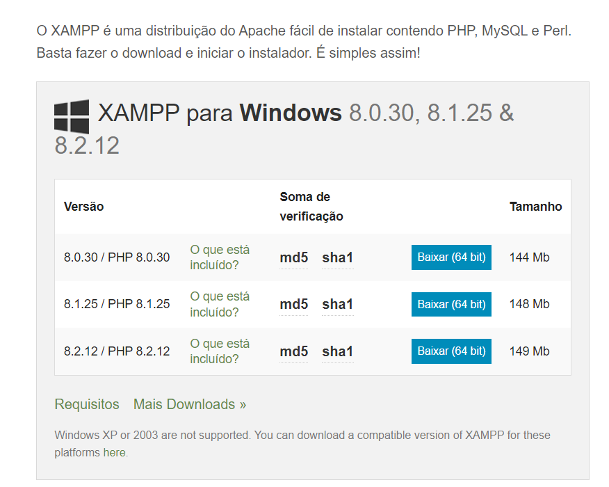
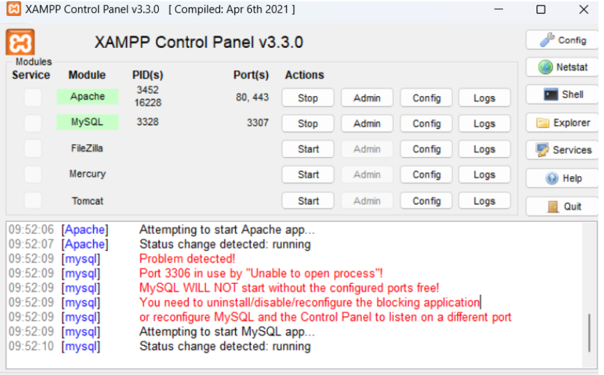
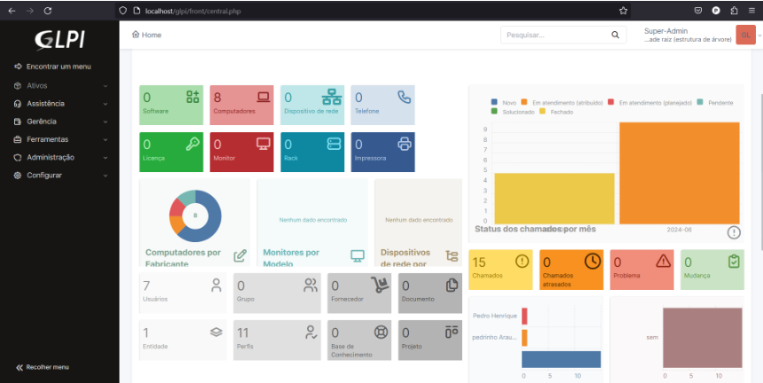

# GLPI

O GLPI (Gestionnaire Libre de Parc Informatique) é um software open source de gestão de recursos de TI e help desk. Desenvolvido pela empresa francesa Teclib', o GLPI é amplamente utilizado por organizações de todos os tamanhos para gerenciar seus ativos de TI, lidar com tickets de suporte, e manter registros detalhados de infraestrutura.

## Instação do GLPI

- [XAMPP](https://www.apachefriends.org/pt_br/download.html): O XAMPP é um pacote com os principais servidores do mercado de código aberto do mercado.
- [VirtualBox](https://www.virtualbox.org/): VirtualBox é um software de virtualização visa criar ambientes para instalação de sistemas distintos.

### Minha Instalação

Eu instalei o GLPI utilizando o XAMPP, pois era uma das maneiras menos problemáticas e mais fáceis para se utilizar.

#### Primeiro Passo

- Ir para a página de download do [XAMPP](https://www.apachefriends.org/pt_br/download.html).
- Escolher a opção de download que corresponde ao seu Sistema Operacional, no meu caso eu usei windows.
  

#### Segundo Passo

- Baixar a versão LTS do [GLPI-downloads](https://glpi-project.org/downloads/) diretamente do site deles.

#### Terceiro Passo

- É necessário extrair a pasta do GLPI do arquivo que foi baixado no passo anterior.

#### Quarto Passo

- Agora com os arquivos extraidos do GLPI, recorte a pasta desses arquivos e vá até o diretório onde se encontra o XAMPP, entrando no diretório da pasta XAMPP, procure pela pasta de nome htdocs e cole os arquivos que foram recortados da pasta do GLPI.
- A partir de agora é possível utilizar todas as funcionalidades do GLPI.

#### Quinto Passo

- Agora com o GLPI funcionando, abra o software XAMPP e inicie o Apache e MySQL, abaixo segue a imagem:
  
- Onde está escrito STOP, começa com START,são esses dois primeiros itens que devem ser ativados.

#### Sexto Passo

- Com o Apache e MySQL funcionando, agora temos tudo para começar a usar o GLPI.
- Vá para o seu navegador e digite na barra de navegação `localhost://glpi`.

#### Sétimo Passo

- Agora basta configurar o que falta no seu sistema GLPI.
- A primeira configuração é ativar a extensão **gd**.
- A segunda configuração é ativar a extensão **itil**.
- Feito isso, as configurações estão finalizadas.

#### Oitavo Passo

- Criar uma conexão do banco de dados com o GLPI para armazenar as informações que serão salvas a partir do GLPI.
- Ele irá pedir o endereço do servidor e o usuário SQL, basta preencher com `endereço = localhost` e usuário SQL `root`, a senha não é necessária.

#### Nono Passo

- Aparecerão mais 2 pop-ups para serem respondidos, basta clicar em continuar nos dois e pronto, seu GLPI estará funcionando perfeitamente para usar, a imagem que deve aparecer é a seguinte:
  
